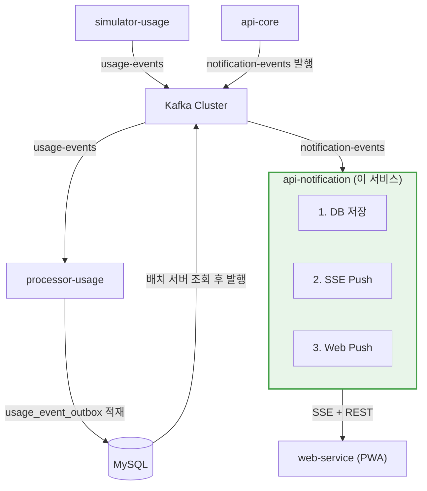
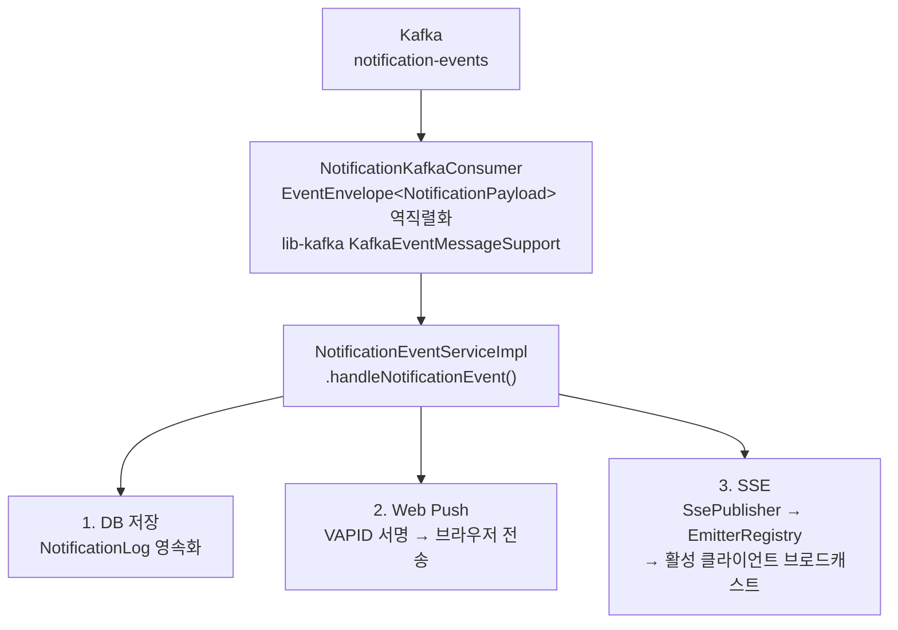
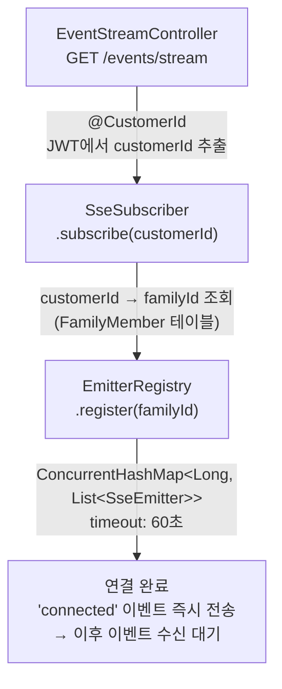
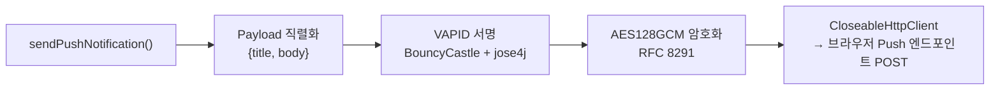

# dabom-api-notification

DABOM 실시간 가족 데이터 통합 관리 시스템의 **알림 서비스**. Kafka 이벤트 기반으로 알림을 수신하여 DB 영속화, SSE 실시간 스트림, Web Push 세 채널로 동시 배포한다.

---

## 1. 🏗️ 시스템 내 위치



- **Upstream**: `processor-usage`, `api-core`가 `notification-events` Kafka 토픽으로 이벤트 발행
- **Downstream**: `web-service`(www.dabom.site) 클라이언트가 SSE 스트림 구독 및 REST API 호출

---

## 2. 🛠️ 기술 스택

| 영역 | 기술 | 버전 |
|------|------|------|
| Runtime | Java | 21 |
| Framework | Spring Boot | 3.4.0 |
| Database | MySQL + Spring Data JPA + QueryDSL | 5.1.0 |
| Cache | Spring Data Redis | - |
| Messaging | Spring Kafka + lib-kafka (사내 공통 라이브러리) | v1.0.1 |
| Real-Time | Spring MVC SSE (`SseEmitter`) | - |
| Web Push | nl.martijndwars/web-push + BouncyCastle | 5.1.2 |
| Auth | JJWT (JWT 자체 구현) | 0.11.2 |
| Docs | SpringDoc OpenAPI (Swagger UI) | 2.7.0 |
| Observability | OpenTelemetry + Micrometer + Prometheus | 1.44.1 |
| Code Quality | Checkstyle (Naver) + Spotless + JaCoCo + SonarQube | - |

---

## 3. ⚡ 핵심 기능

### 3.1 📨 Kafka Consumer — 알림 이벤트 수신

`NotificationKafkaConsumer`가 `notification-events` 토픽을 소비한다.



**알림 분배 규칙**:
- `customerId`가 지정된 이벤트 → 해당 개인에게만 DB 저장 + Push 전송
- `customerId`가 null → `familyId`로 가족 전체 구성원에게 각각 DB 저장 + 가족 단위 Push 전송
- SSE는 항상 `familyId` 단위로 브로드캐스트

**Consumer Group**: `dabom-api-notification` (application.yml 설정)

### 3.2 🔔 알림 타입 (14종)

| 카테고리 | 타입 | 발생 시점 |
|---------|------|----------|
| 사용량 | `QUOTA_UPDATED` | 가족 쿼터 잔여량 변경 |
| 사용량 | `THRESHOLD_ALERT` | 잔여량 50%/30%/10% 임계치 도달 |
| 차단 | `CUSTOMER_BLOCKED` | 개인 한도 초과 / 시간대 차단 / 수동 차단 |
| 차단 | `CUSTOMER_UNBLOCKED` | 차단 해제 |
| 정책 | `POLICY_CHANGED` | 정책 수정 반영 |
| 미션 | `MISSION_CREATED` | 새 미션 생성 (Owner → 가족) |
| 보상 | `REWARD_REQUESTED` | 자녀가 보상 요청 (→ Owner) |
| 보상 | `REWARD_APPROVED` | Owner가 보상 승인 (→ 자녀) |
| 보상 | `REWARD_REJECTED` | Owner가 보상 거절 (→ 자녀) |
| 이의제기 | `APPEAL_CREATED` | 이의제기 요청 (→ Owner) |
| 이의제기 | `APPEAL_APPROVED` | 이의제기 승인 (→ 자녀) |
| 이의제기 | `APPEAL_REJECTED` | 이의제기 거절 (→ 자녀) |
| 긴급요청 | `EMERGENCY_APPROVED` | 긴급 쿼터 자동승인 (→ Owner 사후알림) |
| 관리자 | `ADMIN_PUSH` | 백오피스에서 직접 발송 |

### 3.3 📡 SSE 실시간 스트림

클라이언트가 `GET /events/stream`으로 SSE 연결을 맺으면, 가족 단위로 이벤트를 실시간 수신한다.

**내부 구조**:



**SSE 이벤트 종류**:

| SSE 이벤트명 | 데이터 | 발생 조건 |
|-------------|--------|----------|
| `connected` | 연결 확인 메시지 | 최초 연결 시 |
| `heartbeat` | `"ping"` | 25초 주기 |
| `usage-updated` | `{familyId, totalUsedBytes, totalLimitBytes, remainingBytes}` | 가족 사용량 변경 (1초 폴링) |
| `usage-updated-by-member` | `{familyId, customerId, monthlyUsedBytes}` | 구성원별 사용량 변경 |
| 14종 알림 타입명 | `NotificationPayload` | Kafka 알림 이벤트 수신 시 |

**Usage Polling 메커니즘** (`PollingService`):
1. **1초 주기**로 `family_quota` 테이블에서 활성 가족의 사용량을 IN 쿼리로 일괄 조회 (N+1 방지)
2. `ConcurrentHashMap`으로 이전 `usedBytes`와 비교하여 변경된 가족만 필터링
3. 변경 감지 시 `usage-updated` + `usage-updated-by-member` 이벤트 전송
4. SSE 연결이 없으면 (`activeFamilyIds` 비어있으면) 폴링 자체를 건너뜀

**연결 수명 주기**:
- Emitter timeout: 60초 → 클라이언트가 재연결
- Heartbeat: 25초 주기로 `ping` 전송하여 프록시/로드밸런서 유휴 타임아웃 방지
- 에러 콜백: broken pipe / client abort / EOF 감지 시 자동 정리

### 3.4 🌐 Web Push (VAPID)

RFC 8291 기반 Web Push Protocol을 구현하여 PWA 브라우저에 푸시 알림을 발송한다.



**보안 조치**:
- 구독 엔드포인트 HTTPS 필수 검증
- SSRF 방지: `NetworkValidator.isInternalAddress()`로 내부 IP 주소 차단
- HTTP 클라이언트 타임아웃: connect 5초, socket 5초 (환경변수로 조정 가능)

**구독 관리 (Upsert)**:
- 동일 endpoint 재등록 → 키 정보 갱신
- 다른 customer가 점유한 endpoint → 기존 구독 삭제 후 재할당
- 고객당 1개 구독 유지

---

## 4. 🔌 REST API

### 4.1 🔔 Notifications (`/notifications`)

| Method | Path | 권한 | 설명 |
|--------|------|------|------|
| `GET` | `/notifications` | member | 알림 목록 조회 (커서 기반 무한스크롤) |
| `GET` | `/notifications/unread-count` | member | 읽지 않은 알림 수 |
| `PATCH` | `/notifications/{id}/read` | member | 단건 읽음 처리 |
| `PATCH` | `/notifications/read-all` | member | 전체 읽음 처리 |
| `DELETE` | `/notifications/{id}` | member | 알림 삭제 (soft delete) |

**알림 목록 조회 파라미터**:

| 파라미터 | 타입 | 필수 | 설명 |
|---------|------|------|------|
| `cursor` | string | N | 다음 페이지 커서 (Base64 인코딩 ID) |
| `size` | int | N | 조회 크기 (기본 20) |
| `isRead` | boolean | N | 읽음 상태 필터 |
| `types` | NotificationType[] | N | 알림 타입 필터 (콤마 구분) |

- 보존 기간: **30일** (설정: `app.notification.retention-days`)
- 30일 이전 알림은 조회 결과에서 자동 제외
- 본인 알림만 조회 가능 (customerId JWT 기반 필터링)

### 4.2 📡 Events (`/events`)

| Method | Path | 권한 | 설명 |
|--------|------|------|------|
| `GET` | `/events/stream` | member | SSE 실시간 이벤트 스트림 |
| `GET` | `/events/stream/test/{customerId}` | 없음 | 테스트용 SSE (인증 불필요) |

### 4.3 🌐 Push (`/push`)

| Method | Path | 권한 | 설명 |
|--------|------|------|------|
| `GET` | `/push/vapid-public-key` | 없음 | VAPID 공개키 조회 |
| `POST` | `/push/subscribe` | member | 푸시 구독 등록/갱신 (Upsert) |
| `DELETE` | `/push/subscribe` | member | 푸시 구독 해제 |
| `POST` | `/push/send` | admin | 관리자 직접 푸시 발송 |

### 4.4 📦 응답 형식

공통 래퍼 `ApiResponse<T>` 사용. `api-core`와 동일한 구조.

**성공**:
```json
{
  "success": true,
  "data": { ... },
  "timestamp": "2026-03-20T10:30:00Z"
}
```

**에러**:
```json
{
  "success": false,
  "error": {
    "code": "NOTIFICATION_003",
    "message": "알림을 찾을 수 없습니다."
  },
  "timestamp": "2026-03-20T10:30:00Z"
}
```

> `data`는 성공 시에만, `error`는 실패 시에만 포함된다 (`@JsonInclude(NON_NULL)`).

---

## 5. ❌ 에러 코드

### Notification

| 코드 | HTTP | 설명 |
|------|------|------|
| `NOTIFICATION_001` | 500 | 알림 저장 실패 |
| `NOTIFICATION_002` | 403 | 해당 알림에 대한 권한 없음 |
| `NOTIFICATION_003` | 404 | 알림을 찾을 수 없음 |
| `NOTIFICATION_004` | 400 | 해당 고객의 가족 정보를 찾을 수 없음 |

### Subscription (Push)

| 코드 | HTTP | 설명 |
|------|------|------|
| `SUBSCRIPTION_001` | 404 | 구독 정보를 찾을 수 없음 |
| `SUBSCRIPTION_002` | 500 | 푸시 알림 전송 실패 |
| `SUBSCRIPTION_003` | 400 | 유효하지 않은 구독 엔드포인트 URL |

---

## 6. 💾 데이터 모델

### 6.1 notification_log

알림 이력 저장 테이블. Kafka로 수신된 모든 알림이 고객별로 1건씩 저장된다.

| 컬럼 | 타입 | 설명 |
|------|------|------|
| `id` | BIGINT PK | 자동 증가 |
| `customer_id` | BIGINT | 수신 대상 고객 ID |
| `family_id` | BIGINT | 가족 그룹 ID |
| `type` | VARCHAR (ENUM) | 알림 타입 (14종) |
| `title` | VARCHAR(100) | 알림 제목 |
| `message` | TEXT | 알림 본문 |
| `payload` | JSON | 알림 부가 데이터 |
| `is_read` | BOOLEAN | 읽음 여부 (기본 false) |
| `sent_at` | DATETIME | Kafka 이벤트 발생 시각 |
| `created_at` | DATETIME | 레코드 생성 시각 |
| `updated_at` | DATETIME | 최종 수정 시각 |
| `deleted_at` | DATETIME | Soft Delete 시각 (null = 활성) |

### 6.2 push_subscription

Web Push 구독 정보. 고객당 최대 1건.

| 컬럼 | 타입 | 설명 |
|------|------|------|
| `id` | BIGINT PK | 자동 증가 |
| `endpoint` | VARCHAR (UNIQUE) | 브라우저 Push 엔드포인트 URL |
| `p256dh` | VARCHAR | P-256 ECDH 공개키 |
| `auth` | VARCHAR | 인증 시크릿 |
| `customer_id` | BIGINT | 구독 소유 고객 ID |

### 6.3 참조 엔티티 (읽기 전용)

이 서비스는 아래 테이블을 **조회만** 수행한다 (쓰기 책임은 `api-core` / `processor-usage`에 있음):

| 테이블 | 용도 |
|--------|------|
| `customer` | 고객 기본 정보 |
| `customer_quota` | 고객별 월간 사용량/한도 (SSE member 데이터) |
| `family` | 가족 그룹 정보 |
| `family_member` | 가족 구성원 매핑 — customerId ↔ familyId, role |
| `family_quota` | 가족 월간 총 사용량/쿼터 (SSE 1초 폴링 대상) |

---

## 7. 🔐 인증/인가

JWT 토큰 기반. `LoginInterceptor`가 모든 요청에 대해 `Authorization: Bearer <token>` 헤더를 검증한다.

**JWT Payload**:
```json
{
  "customerId": 12345,
  "familyId": 100,
  "role": "OWNER",
  "exp": 1705312200
}
```

**인증 제외 경로**:
- `/push/vapid-public-key`
- `/events/stream/test/**`
- `/swagger-ui/**`, `/v3/api-docs/**`

**역할 기반 접근 제어**:

| 어노테이션 | 최소 역할 | 용도 |
|-----------|----------|------|
| `@CustomerId` | member | JWT에서 customerId를 ArgumentResolver로 자동 주입 |
| `@OwnerOnly` | owner | AOP Aspect로 Owner 역할 검증 |
| `@AdminOnly` | admin | AOP Aspect로 Admin 역할 검증 (예: `POST /push/send`) |

---

## 8. ⚙️ 설정

### 환경변수

| 변수 | 기본값 | 설명 |
|------|--------|------|
| `SERVER_PORT` | `8080` | 서버 포트 |
| `DATABASE_URL` | `jdbc:mysql://localhost:3310/app_db?...` | MySQL 접속 URL |
| `DATABASE_USER` | `app_user` | DB 사용자 |
| `DATABASE_PASSWORD` | `app_password` | DB 비밀번호 |
| `REDIS_HOST` | `localhost` | Redis 호스트 |
| `REDIS_PORT` | `6379` | Redis 포트 |
| `KAFKA_BOOTSTRAP_SERVERS` | `localhost:9092` | Kafka 브로커 주소 |
| `KAFKA_CONSUMER_GROUP_ID` | `dabom-api-notification` | Kafka Consumer Group |
| `JWT_SECRET_KEY` | (개발용 기본값) | JWT 서명 키 |
| `VAPID_PUBLIC_KEY` | **(필수)** | VAPID 공개키 |
| `VAPID_PRIVATE_KEY` | **(필수)** | VAPID 비밀키 |
| `FRONTEND_URL` | `http://localhost:3000` | CORS 허용 Origin |
| `NOTIFICATION_RETENTION_DAYS` | `30` | 알림 보존 기간 (일) |
| `OTEL_EXPORTER_OTLP_ENDPOINT` | `http://localhost:4318` | OpenTelemetry 수집기 주소 |
| `OTEL_SDK_DISABLED` | `true` | OTel SDK 비활성화 여부 |

### Profiles

| Profile | 용도 |
|---------|------|
| `local` | 로컬 개발 (기본) |
| `dev` | 개발 서버 |
| `prod` | 운영 환경 |

`.env` 파일을 프로젝트 루트에 두면 `bootRun` 시 자동으로 환경변수가 로딩된다.

---

## 9. 📂 프로젝트 구조

```
src/main/java/com/project/
├── Application.java                          # @EnableAsync, @EnableScheduling
│
├── common/
│   ├── api/response/ApiResponse.java         # 공통 응답 래퍼
│   ├── auth/
│   │   ├── JwtTokenUtil.java                 # JWT 검증/파싱
│   │   ├── LoginInterceptor.java             # 인증 인터셉터
│   │   ├── AuthorizationExtractor.java       # Bearer 토큰 추출
│   │   └── aop/
│   │       ├── CustomerId.java               # @CustomerId 어노테이션
│   │       ├── CustomerArgumentResolver.java # customerId 자동 주입
│   │       ├── AdminOnly.java                # @AdminOnly 어노테이션
│   │       ├── AdminOnlyAspect.java          # Admin 역할 검증 AOP
│   │       ├── OwnerOnly.java                # @OwnerOnly 어노테이션
│   │       └── OwnerOnlyAspect.java          # Owner 역할 검증 AOP
│   ├── config/
│   │   ├── WebConfig.java                    # CORS, 인터셉터, ArgumentResolver
│   │   ├── KafkaCommonConfig.java            # lib-kafka 공통 설정 Import
│   │   ├── PushConfig.java                   # VAPID PushService, HttpClient (SSRF 방어)
│   │   ├── JpaConfig.java                    # JPA Auditing 활성화
│   │   ├── QueryDslConfig.java               # JPAQueryFactory 빈
│   │   ├── SwaggerConfig.java                # OpenAPI JWT 인증 스키마
│   │   ├── ThreadPoolConfig.java             # 비동기 스레드풀
│   │   └── CacheProperties.java              # 캐시 설정
│   ├── exception/
│   │   ├── ExceptionAdvice.java              # @RestControllerAdvice (SSE 안전 처리)
│   │   ├── BaseException.java
│   │   ├── ApplicationException.java
│   │   └── code/                             # 도메인별 에러 코드 Enum
│   │       ├── NotificationErrorCode.java
│   │       ├── SubscriptionErrorCode.java
│   │       └── ...
│   └── util/
│       ├── BaseEntity.java                   # created_at, updated_at, deleted_at
│       ├── CursorUtil.java                   # Base64 커서 인코딩/디코딩
│       └── NetworkValidator.java             # 내부 IP 차단 (SSRF 방어)
│
├── domain/
│   ├── notification/                         # ── 알림 도메인 ──
│   │   ├── controller/
│   │   │   └── NotificationController.java   # REST 알림 API (5개 엔드포인트)
│   │   ├── service/
│   │   │   ├── NotificationService[Impl]     # 알림 조회/읽음/삭제
│   │   │   └── NotificationEventService[Impl]# Kafka 이벤트 → DB + Push + SSE
│   │   ├── entity/
│   │   │   ├── NotificationLog.java          # 알림 이력 엔티티
│   │   │   └── NotificationType.java         # 14종 알림 타입 Enum
│   │   ├── repository/
│   │   │   ├── NotificationLogRepository.java
│   │   │   └── ...RepositoryImpl.java        # QueryDSL 커서 기반 페이징
│   │   ├── dto/                              # 요청/응답 DTO
│   │   └── infra/messaging/
│   │       └── NotificationKafkaConsumer.java# Kafka Consumer
│   │
│   ├── event/                                # ── SSE 엔드포인트 ──
│   │   └── controller/
│   │       └── EventStreamController.java    # GET /events/stream (2개)
│   │
│   ├── usagerecord/                          # ── SSE 인프라 ──
│   │   ├── infra/sse/
│   │   │   ├── EmitterRegistry.java          # familyId별 SseEmitter 관리
│   │   │   ├── SseSubscriber.java            # SSE 구독 처리
│   │   │   ├── SsePublisher.java             # 알림 이벤트 SSE 전송
│   │   │   └── PollingService.java           # 사용량 1초 폴링 + 25초 heartbeat
│   │   └── dto/response/                     # 사용량 SSE 응답 DTO
│   │
│   ├── webpush/                              # ── Web Push 도메인 ──
│   │   ├── controller/
│   │   │   └── WebPushController.java        # Push API (4개 엔드포인트)
│   │   ├── service/
│   │   │   └── WebPushServiceImpl.java       # VAPID 서명 + AES128GCM 암호화
│   │   ├── entity/PushSubscription.java
│   │   ├── repository/
│   │   └── dto/                              # 구독 요청/응답 DTO
│   │
│   ├── customer/                             # ── 고객 (읽기 전용) ──
│   │   ├── entity/Customer.java, CustomerQuota.java
│   │   └── repository/
│   │
│   └── family/                               # ── 가족 (읽기 전용) ──
│       ├── entity/Family.java, FamilyMember.java, FamilyQuota.java
│       └── repository/
```

---

## 10. 🚀 실행

```bash
# 환경변수 설정 (.env 파일 또는 직접 export)
cp .env.example .env
# VAPID_PUBLIC_KEY, VAPID_PRIVATE_KEY 필수 설정

# 로컬 실행
./gradlew bootRun

# 빌드
./gradlew build

# 테스트
./gradlew test
```

**필수 인프라**:
- MySQL 8.x (포트 3310 기본)
- Redis (포트 6379 기본)
- Kafka (포트 9092 기본)

---

## 11. 📊 Observability

| 영역 | 도구 | 설정 |
|------|------|------|
| Metrics | Micrometer → Prometheus + OTLP | `/actuator/prometheus` 노출, 15초 주기 OTLP push |
| Traces | OpenTelemetry → OTLP | 로그 패턴에 traceId/spanId 자동 포함 |
| Logs | Logstash JSON Encoder | 구조화 로깅 (`net.logstash.logback`) |
| Health | Spring Actuator | `/actuator/health` (liveness/readiness probes) |

**Actuator 노출 엔드포인트**: `health`, `info`, `prometheus`, `metrics`, `loggers`

**메트릭 히스토그램 대상**: `http.server.requests`, `spring.data.repository.invocations`, `kafka.consumer.processing.time`

---

## 12. 📚 관련 문서

- [기획서 (SPECIFICATION.md)](./SPECIFICATION.md)
- [아키텍처 설계서 (ARCHITECTURE.md)](./ARCHITECTURE.md)
- [API 명세서 (API_SPECIFICATION.md)](./API_SPECIFICATION.md)
- [ERD 설계서 (ERD.md)](./ERD.md)
- [Kafka 메시지 스키마](./designs/kafka/MESSAGE_SCHEMA.md)
- [Redis Key 설계서](./designs/redis/KEY_DESIGN.md)
